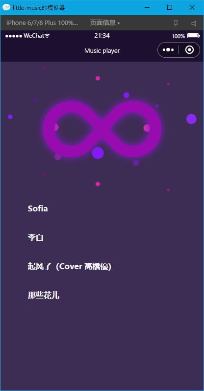
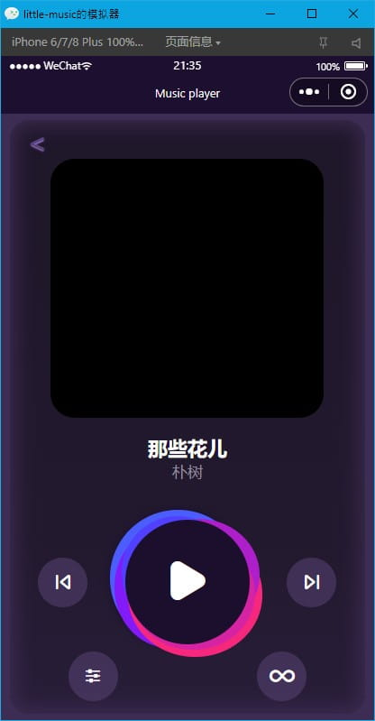
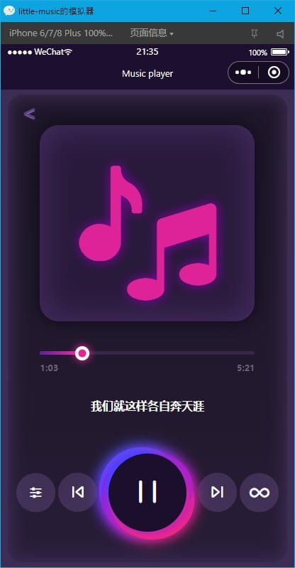
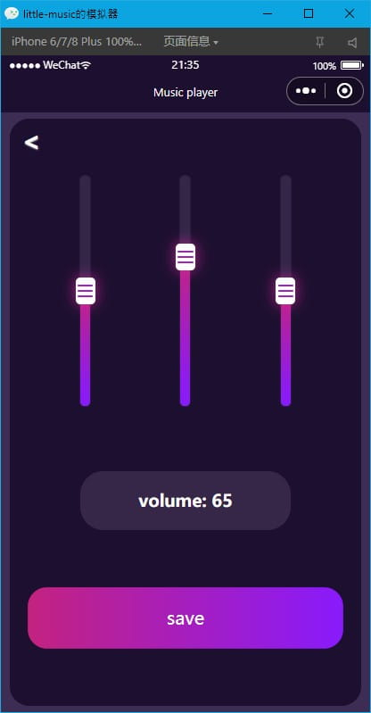
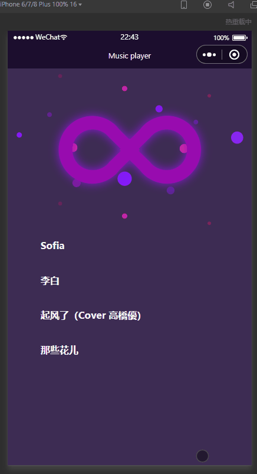

# little-music
**a wechat miniprogram music player (depend on [uni-app](https://uniapp.dcloud.io/))**


## Preview

  

  


<div align=center>
	
</div>


## Installtion

### step 1: install package

```bash
yarn

# or
yarn install
```

### step 2: build

```bash
yarn start

# or
yarn run dev:mp-weixin
```

### step 3: open program

* Drop folder(/dist/dev/mp-weixin) to your [Weixin DevTools](https://developers.weixin.qq.com/miniprogram/dev/devtools/download.html)

